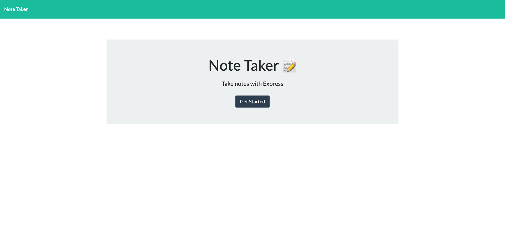
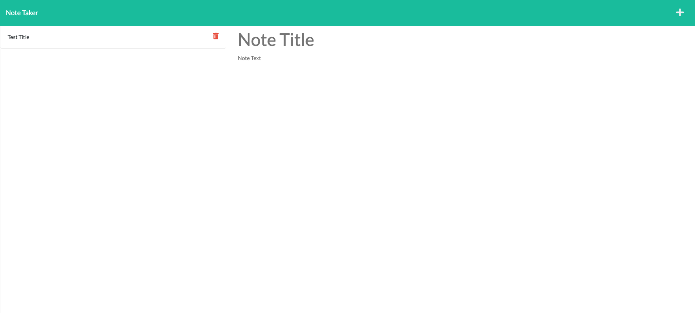

# Note-Taker

# Description
Added back end functionality with express.js to be able to write and save notes to our Note Taker application.

- When the user opens the page they are presented with a Note Taker landing page.
- Once the user enters the note taker page they are presented with a page to input their notes.
- After the user inputs their note that note is saved and is able to be revisited at anytime.

---

## Technologies Used
- [Visual Studio Code](https://code.visualstudio.com/)
- [Node.js](https://nodejs.org/en/)
- [Express package](https://www.npmjs.com/package/express)
- [GitHub](https://www.github.com)
- [Heroku](https://www.heroku.com)

---

## Links 
- [GitHub Repository](https://github.com/VarunTanna/note-taker)
- [Deployed Application](https://frozen-caverns-60448.herokuapp.com/)

## Screenshots

  ## Contact Me
  
  - [GitHub](https://github.com/varuntanna)
  - [Email Me](mailto:varun_tanna@ymail.com)